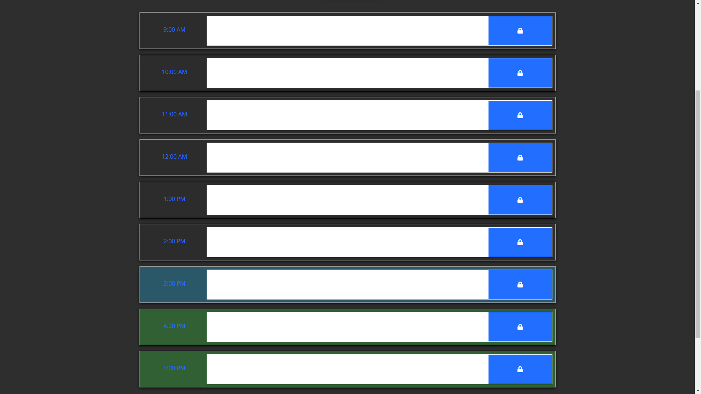

# Work Day Scheduler

This gives users a daily planner that they could add events to so they can manage time effectively.

## Table Of Contents
- [Usage](#usage)
- [Install](#install)
- [Contributions](#contributions)
- [Tests](#tests)
- [Questions](#questions)

## Screenshot

## Install
They could clone it through the GitHub repository

## Usage
They could add events to their work planner

## Questions
Contact me at:
- TDGLU 
- lukemobob@gmail.com
  
  